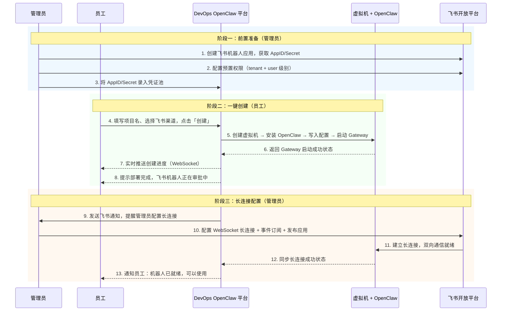
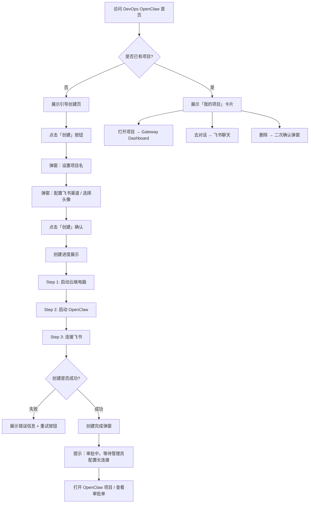
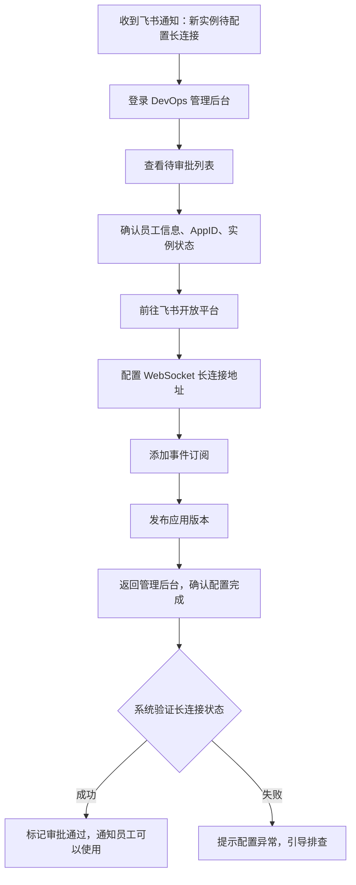

# DevOps OpenClaw 产品需求文档 (PRD)

> 版本：v1.1 | 更新日期：2026-03-26

---

## 1. 背景与目标

### 1.1 产品关系说明

```
OpenClaw（开源项目）        ──  开源个人 AI 助手平台，支持多聊天渠道接入
  https://openclaw.ai            持久记忆、浏览器控制、系统访问、技能扩展
       │
       ▼
飞书 OpenClaw（飞书官方服务）──  飞书基于 OpenClaw 封装的托管服务
  https://openclaw.feishu.cn     一键云端部署，自动接入飞书，面向个人用户
       │
       ▼ 模仿
DevOps OpenClaw（本项目）    ──  企业内部自建的 OpenClaw 托管平台
                                  面向公司全体员工，集中管理，数据自主可控
```

### 1.2 背景

- **OpenClaw** 是一个开源的个人 AI 助手平台，支持通过 WhatsApp、Telegram、Slack、飞书等聊天应用交互，具备持久记忆、浏览器控制、文件系统访问、技能扩展等能力
- **飞书 OpenClaw** 是飞书官方基于 OpenClaw 封装的托管服务，用户点击即可一键云端部署，无需关心底层基础设施
- 公司使用飞书办公，飞书机器人由管理员统一创建和分配，员工无法自主创建机器人
- 飞书 OpenClaw 面向个人用户，不满足企业集中管控需求（如统一凭证管理、实例监控、资源配额等）
- 员工若自行部署 OpenClaw，需要手动创建虚拟机、安装服务、配置飞书机器人对接，流程繁琐且容易出错

### 1.3 目标

本项目旨在**模仿飞书 OpenClaw 的产品体验**，搭建一个企业内部的 OpenClaw 托管平台：

| 目标 | 描述 |
|------|------|
| **降低使用门槛** | 模仿飞书 OpenClaw 的一键部署体验，员工无需关心底层基础设施 |
| **标准化部署** | 统一部署模板和配置，确保每个实例的一致性和安全性 |
| **集中化管理** | 管理员可统一监控和管理所有 OpenClaw 实例的生命周期 |
| **数据自主可控** | 虚拟机部署在公司内部基础设施，数据不出企业边界 |
| **飞书深度集成** | 通过飞书机器人 + WebSocket 长连接，实现与飞书的双向实时通信 |

### 1.4 参考

| 参考 | 说明 |
|------|------|
| https://openclaw.ai | OpenClaw 开源项目官网 |
| https://openclaw.feishu.cn | 飞书 OpenClaw 托管服务（产品体验参考） |
| `docs/images/` | 飞书 OpenClaw UI 截图（设计参考） |
| `docs/permission.json` | 飞书机器人权限配置清单 |
| `docs/design-token.md` | MTP Web 设计令牌规范 |

---

## 2. 用户角色

| 角色 | 描述 | 核心诉求 |
|------|------|----------|
| **员工** | 普通企业用户 | 像使用飞书 OpenClaw 一样，一键创建专属 AI 助手并通过飞书对话 |
| **管理员** | DevOps 平台管理员 | 统一管理飞书机器人凭证、配置长连接、监控所有实例运行状态 |

---

## 3. 信息架构

```
DevOps OpenClaw 平台
│
├── 员工端（前台）
│   │
│   ├── 🏠 首页 / 落地页
│   │   ├── 产品介绍
│   │   │   ├── 一键部署，开箱即用
│   │   │   ├── 原生体验，能力无损（完整 OpenClaw 能力）
│   │   │   └── 企业级安全，数据不离场
│   │   └── 创建入口（CTA 按钮「立即部署」/「创建」）
│   │
│   ├── 📦 创建流程
│   │   ├── 创建项目弹窗
│   │   │   ├── 设置项目名
│   │   │   └── 配置飞书渠道（机器人名称 + 选择头像）
│   │   ├── 创建进度展示（实时状态）
│   │   │   ├── Step 1: 启动云端电脑（虚拟机创建）
│   │   │   ├── Step 2: 启动 OpenClaw（服务部署）
│   │   │   └── Step 3: 连接飞书（Gateway 启动 + 凭证写入）
│   │   └── 创建结果
│   │       ├── 成功 → 部署完成提示 + 审批状态
│   │       ├── 操作按钮：打开 OpenClaw 项目 / 查看审批单
│   │       └── 失败 → 错误信息 + 重试按钮
│   │
│   ├── 📋 我的项目（已创建状态）
│   │   ├── 项目卡片
│   │   │   ├── 头像 + 项目名称
│   │   │   ├── 状态标签（已部署 / 审批中 / 异常）
│   │   │   ├── 「打开项目」→ 跳转 OpenClaw Gateway Dashboard
│   │   │   ├── 「去对话」→ 跳转飞书与机器人聊天
│   │   │   └── 「...」更多菜单 → 删除
│   │   └── 删除操作（二次确认弹窗：「删除后内容无法恢复」）
│   │
│   └── 🖥️ OpenClaw Gateway Dashboard（嵌入 iframe / 新窗口跳转）
│       ├── 聊天 ── 直连网关的调试聊天会话
│       ├── 概览 ── 实例运行概况
│       ├── 通道 ── 飞书渠道连接状态
│       ├── 实例 ── OpenClaw 进程管理
│       ├── 会话 ── 历史对话记录
│       ├── 使用情况 ── Token 用量统计
│       ├── 定时任务 ── Cron 任务管理
│       ├── 代理 ── AI Agent 配置
│       ├── 节点 ── 工作流节点编辑
│       ├── 配置 ── openclaw.json 代码模式编辑
│       ├── 日志 ── 运行日志查看
│       └── 文档 ── 使用文档
│
├── 管理端（后台）
│   │
│   ├── 📊 仪表盘
│   │   ├── 实例统计（总数 / 运行中 / 已停止 / 异常）
│   │   ├── 资源使用概览（CPU / 内存 / 存储 / 网络）
│   │   ├── 近期创建趋势图
│   │   └── 待处理事项（待审批长连接、异常实例）
│   │
│   ├── 🗂️ 实例管理
│   │   ├── 实例列表（搜索、筛选、排序、分页）
│   │   │   ├── 实例名称 / 所属员工
│   │   │   ├── 虚拟机状态（运行中 / 已停止 / 异常）
│   │   │   ├── 飞书连接状态（已连接 / 待配置 / 断开）
│   │   │   └── 创建时间 / 最后活跃时间
│   │   ├── 实例详情
│   │   │   ├── 基本信息（项目名、员工、AppID）
│   │   │   ├── 虚拟机信息（IP、规格、运行时长）
│   │   │   ├── 服务状态（Gateway 健康检查、版本号）
│   │   │   └── 操作日志（创建/重启/配置变更记录）
│   │   └── 实例操作
│   │       ├── 启动 / 停止 / 重启
│   │       ├── 配置长连接（跳转飞书开放平台引导）
│   │       └── 强制删除（释放资源）
│   │
│   ├── 🤖 机器人管理
│   │   ├── 凭证池（AppID / Secret 列表）
│   │   │   ├── 状态：未分配 / 已分配 / 已停用
│   │   │   └── 关联员工和实例信息
│   │   ├── 批量导入凭证
│   │   ├── 权限模板管理（基于 permission.json）
│   │   └── 长连接配置状态总览
│   │
│   ├── ✅ 审批管理
│   │   ├── 待审批列表（员工提交的长连接配置请求）
│   │   ├── 已审批记录
│   │   └── 通知设置（飞书消息通知管理员）
│   │
│   ├── 💰 资源管理
│   │   ├── 虚拟机资源池（可用/已用/预留）
│   │   ├── 资源配额策略（每人上限、规格限制）
│   │   └── 成本统计报表
│   │
│   └── ⚙️ 系统设置
│       ├── 部署模板配置（VM 规格、OpenClaw 版本、默认 openclaw.json）
│       ├── 平台权限管理（管理员角色分配）
│       └── 通知配置（告警渠道、通知规则）
│
└── 后端服务
    │
    ├── 🔧 编排引擎
    │   ├── 虚拟机生命周期管理（创建/启动/停止/销毁）
    │   ├── OpenClaw 自动安装（npm i -g openclaw 或镜像部署）
    │   ├── 配置文件注入（openclaw.json 生成与写入）
    │   └── Gateway 服务启动与注册
    │
    ├── 🔗 飞书集成服务
    │   ├── 机器人凭证管理（AppID/Secret 加密存储）
    │   ├── 飞书开放平台 API 对接
    │   ├── 长连接状态监听与同步
    │   └── 权限预置（批量配置 tenant/user 权限）
    │
    ├── 📡 监控服务
    │   ├── 虚拟机健康检查（心跳探测）
    │   ├── Gateway 服务探活（HTTP 健康端点）
    │   ├── 飞书长连接状态监控
    │   └── 异常告警（飞书消息 / 邮件）
    │
    └── 🌐 API Gateway
        ├── 员工端 API（创建/查询/删除项目）
        ├── 管理端 API（实例管理/审批/统计）
        ├── 飞书登录鉴权（OAuth 2.0）
        └── WebSocket（创建进度实时推送）
```

---

## 4. 核心流程

### 4.1 部署时序图



### 4.2 员工创建流程



### 4.3 管理员配置流程



---

## 5. 功能需求

### 5.1 员工端

#### P0 - 核心功能

| 功能 | 描述 | 参考截图 |
|------|------|----------|
| **一键创建 OpenClaw** | 填写项目名和飞书渠道信息，一键完成虚拟机创建、OpenClaw 安装和 Gateway 启动 | `02-创建项目.png` |
| **创建进度实时展示** | 分步骤展示创建进度（启动云端电脑 → 启动 OpenClaw → 连接飞书），每步含耗时 | `03-创建中.png` |
| **项目状态展示** | 项目卡片展示部署状态（创建中 / 已部署 / 审批中 / 异常），含操作按钮 | `05-已创建状态.png` |
| **打开项目** | 跳转至 OpenClaw Gateway Dashboard，管理聊天、配置、技能等 | `11-管理面板.png` |
| **去对话** | 跳转至飞书与机器人直接聊天 | - |
| **删除项目** | 二次确认后删除项目，释放虚拟机资源，数据不可恢复 | `06-删除.png` |

#### P1 - 增强功能

| 功能 | 描述 |
|------|------|
| 审批状态追踪 | 查看管理员配置长连接的审批进度 |
| 机器人凭证查看 | 查看 APP ID、APP Secret（脱敏展示，支持复制） |
| 自助重启 | 遇到异常时可自助重启 OpenClaw 服务 |
| 多项目支持 | 一个员工可创建多个 OpenClaw 实例（受配额限制） |

### 5.2 管理端

#### P0 - 核心功能

| 功能 | 描述 |
|------|------|
| **实例列表** | 查看所有 OpenClaw 实例，支持按状态/员工/时间筛选和排序 |
| **实例监控** | 查看虚拟机运行状态、Gateway 服务健康状态、飞书长连接状态 |
| **长连接审批** | 处理员工创建后的长连接配置请求，引导管理员完成飞书平台配置 |
| **实例操作** | 启动 / 停止 / 重启 / 强制删除实例 |
| **凭证池管理** | 管理 AppID/Secret 凭证池，支持批量导入和分配 |

#### P1 - 增强功能

| 功能 | 描述 |
|------|------|
| 仪表盘概览 | 实例总数、资源使用、异常告警、待办事项等全局视图 |
| 资源配额管理 | 设置每人创建上限、虚拟机规格限制 |
| 操作日志审计 | 记录所有管理操作的审计日志 |
| 批量操作 | 批量启停实例、批量配置长连接 |
| OpenClaw 版本管理 | 统一管理和升级所有实例的 OpenClaw 版本 |

### 5.3 后端服务

| 功能 | 描述 |
|------|------|
| **虚拟机编排** | 自动创建虚拟机、配置网络环境 |
| **OpenClaw 自动安装** | 在虚拟机中执行 `npm i -g openclaw` 或部署预制镜像 |
| **配置注入** | 根据 AppID/Secret 和模板自动生成 `openclaw.json` 配置文件 |
| **Gateway 启动** | 自动启动 OpenClaw Gateway 服务并注册到平台 |
| **健康检查** | 定期检测虚拟机存活、Gateway 服务可用性、飞书长连接状态 |
| **状态同步** | 监听飞书长连接建立状态并通过 WebSocket 实时同步至前端 |
| **飞书登录集成** | 使用飞书 OAuth 2.0 实现平台统一登录 |

---

## 6. 飞书机器人权限配置

管理员在飞书开放平台创建机器人时需预置以下权限（完整清单见 `docs/permission.json`）：

### 6.1 应用权限（tenant 级别）

供机器人以应用身份调用，无需用户授权：

| 权限分类 | 权限项 | 说明 |
|----------|--------|------|
| 应用管理 | `application:application:self_manage` | 应用自身管理 |
| 消息发送 | `im:message:send_as_bot` | 以机器人身份发送消息 |
| 消息读取 | `im:message:readonly` | 读取聊天消息 |
| 消息管理 | `im:message:recall` / `im:message:update` | 撤回和更新消息 |
| 群组 | `im:chat:read` / `im:chat:update` | 读取和更新群组信息 |
| 通讯录 | `contact:contact.base:readonly` | 读取通讯录基础信息 |
| 卡片 | `cardkit:card:read` / `cardkit:card:write` | 互动卡片读写 |
| 文档 | `docx:document:readonly` | 读取文档内容 |

### 6.2 用户权限（user 级别）

以用户身份操作飞书功能，需用户授权：

| 权限分类 | 能力范围 |
|----------|----------|
| 多维表格 | 完整 CRUD —— 应用/表/字段/记录/视图的创建、读取、更新、删除 |
| 日历 | 日程的创建/读取/更新/删除/回复，空闲忙碌查询 |
| 文档 | 文档创建/读取/编辑/评论/导出，媒体上传下载 |
| 表格 | 电子表格创建/读取/写入 |
| 云盘 | 文件上传/下载，元数据读取 |
| 任务 | 任务和任务列表的读写 |
| 知识库 | 知识空间和节点的读写、复制、移动 |
| 消息 | 单聊和群聊消息的读取与发送 |
| 通讯录/搜索 | 用户信息查询、消息搜索、文档搜索 |
| 白板 | 白板节点的创建和读取 |

---

## 7. OpenClaw 核心能力

部署完成后，每个员工的 OpenClaw 实例具备以下能力（源自 OpenClaw 开源项目）：

| 能力 | 描述 |
|------|------|
| **多模型支持** | 支持 Anthropic Claude、OpenAI、Kimi 等多种 AI 模型，可在 Gateway Dashboard 中切换 |
| **持久记忆** | 长期记忆用户偏好和上下文，跨会话保持连续性 |
| **飞书消息交互** | 通过飞书机器人收发消息，支持文本、卡片、文件等多种消息类型 |
| **浏览器控制** | 内置 Chromium 浏览器，支持网页浏览、表单填充、数据提取 |
| **文件系统访问** | 读写虚拟机文件、执行 Shell 命令 |
| **飞书能力集成** | 通过用户级权限操作飞书文档、表格、日历、任务、知识库等 |
| **技能扩展** | 支持安装社区技能或自定义开发技能 |
| **定时任务** | 支持 Cron 定时任务，定期执行自动化操作 |
| **配置编辑** | 通过 Gateway Dashboard 的代码模式直接编辑 `openclaw.json` |

---

## 8. 页面设计说明

### 8.1 页面清单与截图对照

| 序号 | 页面 | 参考截图 | 说明 |
|------|------|----------|------|
| 1 | 产品落地页 | `00飞书 openclaw-落地页.png` | 外部宣传页，产品卖点展示（参考风格） |
| 2 | 首页/引导创建 | `01飞书 openclaw-引导创建.png` | 登录后首页，展示三大特性 + 创建入口 |
| 3 | 创建项目弹窗 | `02飞书 openclaw-创建项目.png` | 项目名输入 + 飞书渠道选择（头像） |
| 4 | 创建中进度 | `03飞书 openclaw-创建中.png` | 三步进度条，每步显示耗时 |
| 5 | 创建完成 | `04 飞书 openclaw-创建完成.png` | 部署成功 + 审批提示 + 操作按钮 |
| 6 | 已创建状态 | `05openclaw-已创建状态.png` | 项目卡片（头像、名称、状态、操作） |
| 7 | 删除确认 | `06openclaw-已创建状态-删除.png` | 二次确认弹窗 |
| 8 | Gateway 控制台 | `11openclaw-管理面板-控制台.png` | OpenClaw 自带的聊天调试界面 |
| 9 | 机器人信息 | `12openclaw-管理面板-机器人信息.png` | AppID/Secret 查看面板 |
| 10 | 代码模式 | `13openclaw-管理面板-代码模式.png` | openclaw.json 配置编辑器 |

### 8.2 设计规范

遵循 `docs/design-token.md` 中定义的 MTP Web 设计令牌体系：

| 维度 | 规范 |
|------|------|
| 品牌主色 | `#006eff` |
| 页面背景 | `#f7f7f7`，卡片背景 `#ffffff` |
| 圆角 | 卡片 `4px`、弹窗 `6px`、按钮 `6px` |
| 阴影 | 卡片 `0px 0px 2px rgba(0,0,0,0.1)`，弹窗 `0 4px 12px rgba(0,0,0,0.2)` |
| 字号 | 正文 `14px`、标题 `18px`、小字 `12px` |
| 状态色 | 成功 `#00b81f`、警告 `#ff8800`、错误 `#f23030`、信息 `#409eff` |

---

## 9. 非功能需求

| 维度 | 要求 |
|------|------|
| **性能** | 虚拟机创建 + OpenClaw 安装 + Gateway 启动应在 2 分钟内完成 |
| **可用性** | Gateway 服务可用性 ≥ 99.5%，平台本身可用性 ≥ 99.9% |
| **安全性** | AppID/Secret 加密存储（AES-256），传输 HTTPS，操作审计日志 |
| **可扩展性** | 支持同时运行 100+ OpenClaw 实例 |
| **监控** | 实例异常在 1 分钟内触发告警，通过飞书消息通知管理员 |
| **数据安全** | 所有数据存储在企业内部基础设施，不经过外部第三方服务 |
| **兼容性** | 前端支持 Chrome、Edge、飞书内置浏览器 |

---

## 10. 里程碑规划

| 阶段 | 范围 | 交付物 |
|------|------|--------|
| **Phase 1 - MVP** | 员工一键创建 + 管理员基础管理 | 创建流程全链路、实例列表、凭证池管理 |
| **Phase 2 - 体验优化** | 审批流自动化 + 监控告警 | 长连接配置半自动化、健康监控、飞书告警通知 |
| **Phase 3 - 规模化** | 资源配额 + 自助运维 + 版本管理 | 员工自助重启/扩容、配额策略、统一版本升级 |

---

## 11. 术语表

| 术语 | 说明 |
|------|------|
| **OpenClaw** | 开源个人 AI 助手平台（https://openclaw.ai），支持多聊天渠道接入、持久记忆、浏览器控制、系统访问、技能扩展 |
| **飞书 OpenClaw** | 飞书官方基于 OpenClaw 封装的托管服务（https://openclaw.feishu.cn），本项目的产品体验参考 |
| **DevOps OpenClaw** | 本项目，企业内部自建的 OpenClaw 托管平台 |
| **Gateway** | OpenClaw 内置的网关服务，负责消息路由、渠道对接和管理控制台 |
| **Gateway Dashboard** | OpenClaw Gateway 自带的 Web 管理控制台，提供聊天调试、配置编辑、日志查看等功能 |
| **AppID / Secret** | 飞书机器人应用凭证，用于飞书开放平台 API 鉴权 |
| **长连接** | 飞书 WebSocket 长连接协议，实现机器人与飞书平台的双向实时通信，需管理员在飞书开放平台手动配置 |
| **openclaw.json** | OpenClaw 核心配置文件，包含模型配置、渠道设置、浏览器参数、密钥等 |
| **凭证池** | 管理端维护的 AppID/Secret 集合，管理员预先创建并录入，员工创建时自动分配 |
