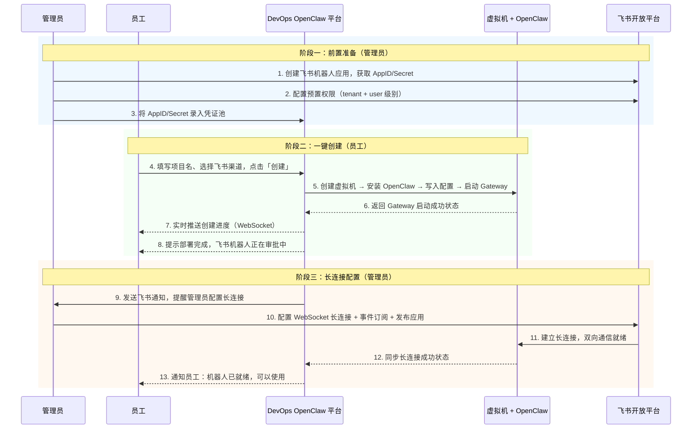
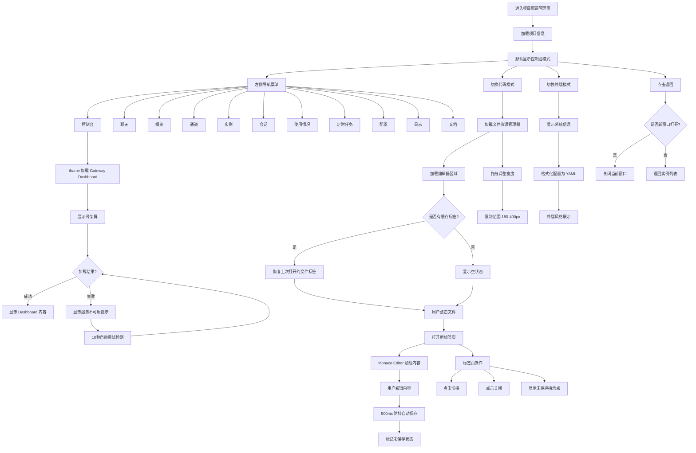

# DevOps OpenClaw 产品需求文档 (PRD)

> 版本：v1.3 | 更新日期：2026-03-27

---

## 1. 背景与目标

### 1.1 产品关系说明

```
OpenClaw（开源项目）        ──  开源个人 AI 助手平台，支持多聊天渠道接入
  https://openclaw.ai            持久记忆、浏览器控制、系统访问、技能扩展
       │
       ▼
飞书 OpenClaw（飞书官方服务）──  飞书基于 OpenClaw 封装的托管服务
  https://openclaw.feishu.cn     一键云端部署，自动接入飞书，面向个人用户
       │
       ▼ 模仿
DevOps OpenClaw（本项目）    ──  企业内部自建的 OpenClaw 托管平台
                                  面向公司全体员工，集中管理，数据自主可控
```

### 1.2 背景

- **OpenClaw** 是一个开源的个人 AI 助手平台，支持通过 WhatsApp、Telegram、Slack、飞书等聊天应用交互，具备持久记忆、浏览器控制、文件系统访问、技能扩展等能力
- **飞书 OpenClaw** 是飞书官方基于 OpenClaw 封装的托管服务，用户点击即可一键云端部署，无需关心底层基础设施
- 公司使用飞书办公，飞书机器人由管理员统一创建和分配，员工无法自主创建机器人
- 飞书 OpenClaw 面向个人用户，不满足企业集中管控需求（如统一凭证管理、实例监控、资源配额等）
- 员工若自行部署 OpenClaw，需要手动创建虚拟机、安装服务、配置飞书机器人对接，流程繁琐且容易出错

### 1.3 目标

本项目旨在**模仿飞书 OpenClaw 的产品体验**，搭建一个企业内部的 OpenClaw 托管平台：

| 目标 | 描述 |
|------|------|
| **降低使用门槛** | 模仿飞书 OpenClaw 的一键部署体验，员工无需关心底层基础设施 |
| **标准化部署** | 统一部署模板和配置，确保每个实例的一致性和安全性 |
| **集中化管理** | 管理员可统一监控和管理所有 OpenClaw 实例的生命周期 |
| **数据自主可控** | 虚拟机部署在公司内部基础设施，数据不出企业边界 |
| **飞书深度集成** | 通过飞书机器人 + WebSocket 长连接，实现与飞书的双向实时通信 |

### 1.4 参考

| 参考 | 说明 |
|------|------|
| https://openclaw.ai | OpenClaw 开源项目官网 |
| https://openclaw.feishu.cn | 飞书 OpenClaw 托管服务（产品体验参考） |
| `docs/images/` | 飞书 OpenClaw UI 截图（设计参考） |
| `docs/permission.json` | 飞书机器人权限配置清单 |
| `docs/design-token.md` | MTP Web 设计令牌规范 |

---

## 2. 用户角色

| 角色 | 描述 | 核心诉求 |
|------|------|----------|
| **员工** | 普通企业用户 | 像使用飞书 OpenClaw 一样，一键创建专属 AI 助手并通过飞书对话 |
| **管理员** | DevOps 平台管理员 | 统一管理飞书机器人凭证、配置长连接、监控所有实例运行状态 |

---

## 3. 信息架构

```
DevOps OpenClaw 平台
│
├── 🔐 认证系统
│   ├── 用户名/密码登录（全局登录弹窗）
│   ├── JWT Token 管理（accessToken + refreshToken + expiresAt）
│   ├── Token 自动刷新（过期前 5 分钟定时刷新）
│   ├── 401 自动重试（刷新 Token 后自动重发失败请求）
│   └── 登录态持久化（localStorage + 页面刷新恢复）
│
├── 员工端（前台）
│   │
│   ├── 🏠 首页 / 落地页
│   │   ├── 营销落地页
│   │   │   ├── 全屏 Hero 区域（光晕动画 + 图片缩放特效）
│   │   │   ├── 三栏特性卡片（一键部署/原生体验/企业级安全）
│   │   │   ├── 鼠标跟随提示气泡（CursorTips）
│   │   │   └── 页脚
│   │   ├── 员工首页（状态机切换）
│   │   │   ├── loading → 加载中
│   │   │   ├── empty → 引导创建（Hero + FeatureList + CreateGuide）
│   │   │   ├── has_project → 我的项目（ProjectCard + FeatureList）
│   │   │   └── admin → 项目配置管理
│   │   └── 顶部导航栏（AppHeader）
│   │       ├── 品牌标识 + UserDropdown
│   │       └── 登录按钮 / 用户信息
│   │
│   ├── 📦 创建流程
│   │   ├── 创建项目弹窗（CreateModal）
│   │   │   ├── 设置项目名（实时校验）
│   │   │   └── 配置飞书渠道（12 个头像选择 + 可选 AppID/AppSecret + 跳过选项）
│   │   ├── 创建进度展示（ProgressModal，实时轮询 2s）
│   │   │   ├── Step 1: 启动云端电脑（虚拟机创建）
│   │   │   ├── Step 2: 启动 OpenClaw（服务部署，完成后可跳转至步骤3）
│   │   │   └── Step 3: 连接飞书（Gateway 启动 + 凭证写入）
│   │   └── 创建结果（CompleteModal）
│   │       ├── 成功 → 部署完成提示 + 审批状态
│   │       ├── 操作按钮：配置 OpenClaw
│   │       └── 失败 → 错误信息 + 重试按钮
│   │
│   ├── 📋 我的项目（已创建状态）
│   │   ├── 项目卡片（ProjectCard）
│   │   │   ├── 头像 + 项目名称
│   │   │   ├── 状态标签（创建中 / 已部署 / 审批中 / 异常）
│   │   │   ├── 「配置 OpenClaw」→ 跳转项目配置管理页
│   │   │   ├── 机器人信息下拉菜单（BotInfoDropdown）→ 查看/复制凭证、去对话
│   │   │   └── 「...」更多菜单 → 删除
│   │   └── 删除操作（DeleteConfirm 弹窗：「删除后内容无法恢复」）
│   │
│   └── 🖥️ OpenClaw 项目配置管理（/projects/:id/admin）
│       ├── 顶部工具栏
│       │   ├── 返回按钮
│       │   ├── 项目头像 + 名称 + 状态标签
│       │   └── 视图模式切换（控制台 / 代码模式 / 终端）
│       │
│       ├── 控制台模式
│       │   ├── 左侧导航菜单（11 项）
│       │   │   ├── 控制台（默认）→ ConsoleView
│       │   │   ├── 聊天 → iframe `/chat`
│       │   │   ├── 概览 → iframe `/overview`
│       │   │   ├── 通道 → iframe `/channels`
│       │   │   ├── 实例 → iframe `/instances`
│       │   │   ├── 会话 → iframe `/sessions`
│       │   │   ├── 使用情况 → iframe `/usage`
│       │   │   ├── 定时任务 → iframe `/schedules`
│       │   │   ├── 配置 → iframe `/code`
│       │   │   ├── 日志 → iframe `/logs`
│       │   │   └── 文档 → iframe `/docs`
│       │   ├── 右侧内容区域
│       │   │   ├── 控制台菜单 → ConsoleView 组件
│       │   │   ├── 其余菜单 → iframe Gateway Dashboard
│       │   │   ├── 骨架屏加载状态
│       │   │   ├── 服务不可用错误提示
│       │   │   └── 自动健康检查（10秒轮询）
│       │   └── 机器人信息下拉
│       │       ├── AppID / AppSecret 脱敏展示
│       │       └── 快捷操作：去对话
│       │
│       ├── 代码模式（ConfigCodeMode）
│       │   ├── 左侧文件资源管理器
│       │   │   ├── 标题栏 + 操作按钮（新建文件/文件夹/刷新）
│       │   │   ├── 搜索框（实时过滤）
│       │   │   ├── 文件树展示（树形结构、展开/收起）
│       │   │   └── 拖拽调整面板宽度（180-400px）
│       │   ├── 右侧编辑器区域
│       │   │   ├── 标签栏（多文件 Tab 切换、关闭、未保存标记）
│       │   │   ├── 面包屑导航（文件路径）
│       │   │   ├── Monaco Editor 代码编辑
│       │   │   │   ├── JSON 语法高亮
│       │   │   │   ├── 自动保存（500ms 防抖）
│       │   │   │   └── 快捷键：Ctrl+S 手动保存
│       │   │   ├── 空状态提示
│       │   │   └── 状态栏（行列信息、文件类型、编码）
│       │   └── 支持文件类型：JSON、YAML、文本文件
│       │
│       └── 终端模式（TerminalView）
│           ├── 终端欢迎信息
│           ├── 系统信息展示（负载、内存使用率、配置大小、最后修改时间）
│           ├── 配置文件 YAML 格式预览（cat config.yaml 风格）
│           ├── 闪烁光标动画
│           └── 终端风格界面（深色主题、等宽字体）
│
├── 管理端（后台）
│   │
│   ├── 管理端布局（AdminLayout）
│   │   ├── 顶部导航栏（返回按钮 + 品牌标识 + UserDropdown）
│   │   ├── 左侧边栏导航
│   │   │   ├── 仪表盘
│   │   │   ├── 实例管理
│   │   │   ├── 全局配置
│   │   │   └── 审批管理
│   │   └── 右侧内容区（router-view）
│   │
│   ├── 📊 仪表盘（AdminDashboard）
│   │   ├── 统计卡片（总数 / 运行中 / 已停止 / 异常）
│   │   │   └── 可点击跳转实例列表（带状态筛选）
│   │   ├── 资源使用概览（CPU / 内存 / 存储 / 网络）
│   │   │   └── NProgress 进度条可视化
│   │   ├── 创建趋势图
│   │   │   ├── 时间范围选择器（7天/30天/90天/自定义）
│   │   │   ├── 交互式趋势图表（InteractiveTrendChart）
│   │   │   └── 刷新按钮
│   │   └── 待处理事项（待审批长连接、异常实例）
│   │       └── 快捷操作跳转
│   │
│   ├── 🗂️ 实例管理（InstanceList）
│   │   ├── 实例列表（搜索防抖 300ms + 多选状态筛选 + 排序 + 分页）
│   │   │   ├── 实例名称 / 所属员工
│   │   │   ├── 虚拟机状态（运行中 / 已停止 / 异常）
│   │   │   ├── 飞书连接状态（已连接 / 待配置 / 断开）
│   │   │   └── 创建时间 / 最后活跃时间
│   │   ├── 管理员创建实例（InstanceCreateModal）
│   │   │   ├── 三步视图：表单 → 进度 → 成功
│   │   │   ├── 实例名 + 可选飞书渠道 + 头像选择
│   │   │   └── 「跳过机器人配置」选项
│   │   ├── 实例详情抽屉（InstanceDrawer）
│   │   │   ├── 基本信息（项目名、员工、AppID、创建时间）
│   │   │   ├── 虚拟机信息（IP、规格、运行时长）
│   │   │   ├── 服务状态（Gateway 健康检查、OpenClaw 版本、飞书长连接状态）
│   │   │   └── 操作日志（NTimeline 时间线）
│   │   └── 实例操作（7 种，每种独立确认弹窗）
│   │       ├── 启动（直接执行）
│   │       ├── 重启（RestartConfirmModal）
│   │       ├── 重启 Gateway（RestartGatewayConfirmModal）
│   │       ├── 修复配置（RepairConfigConfirmModal）
│   │       ├── 恢复初始设置（ResetInstanceConfirmModal）
│   │       ├── 停止（StopConfirmModal）
│   │       └── 强制删除（DeleteInstanceConfirmModal）
│   │
│   ├── ⚙️ 全局配置（GlobalConfig）
│   │   ├── 模型配置
│   │   │   ├── 供应商选择（Anthropic / OpenAI / DeepSeek / 自定义）
│   │   │   ├── API Key（脱敏展示 + 更新）
│   │   │   ├── Base URL 配置
│   │   │   ├── 默认模型选择
│   │   │   ├── 最大 Token 限制
│   │   │   └── 温度（Temperature）调节
│   │   ├── Memory 配置
│   │   │   ├── 启用/禁用开关
│   │   │   ├── 策略选择（滚动窗口 / 摘要 / 混合）
│   │   │   ├── 上下文上限
│   │   │   └── 保留天数
│   │   ├── 发布策略
│   │   │   ├── 应用范围（全部实例 / 仅运行中 / 仅已停止 / 指定实例）
│   │   │   ├── 生效策略（强制生效 / 条件生效 / 下次启动生效）
│   │   │   └── 发布确认弹窗（显示完整参数和影响范围）
│   │   └── 已停止实例降级警告
│   │
│   └── ✅ 审批管理（ApprovalBoard）
│       ├── 视图模式切换（卡片 / 列表）
│       │   └── 本地存储记忆用户选择
│       ├── 配置引导提示（ApprovalGuide）
│       │   ├── 可折叠的步骤说明
│       │   └── 可关闭的提示框
│       ├── 状态筛选（全部 / 待审批 / 已审批）
│       ├── 卡片视图（ApprovalCard）
│       │   ├── 实例头像 + 名称
│       │   ├── 员工信息
│       │   ├── AppID 展示
│       │   ├── 提交时间
│       │   └── 审批操作按钮
│       ├── 列表视图（ApprovalListItem）
│       │   ├── 表头：员工、实例、AppID、提交时间、状态、操作
│       │   └── 响应式隐藏（小屏幕自动切换卡片）
│       └── 审批操作
│           └── 一键通过 + 连接验证
│
└── 后端服务
    │
    ├── 🔧 编排引擎
    │   ├── 虚拟机生命周期管理（创建/启动/停止/销毁）
    │   ├── OpenClaw 自动安装（npm i -g openclaw 或镜像部署）
    │   ├── 配置文件注入（openclaw.json 生成与写入）
    │   └── Gateway 服务启动与注册
    │
    ├── 🔗 飞书集成服务
    │   ├── 机器人凭证管理（AppID/Secret 加密存储）
    │   ├── 飞书开放平台 API 对接
    │   ├── 长连接状态监听与同步
    │   └── 权限预置（批量配置 tenant/user 权限）
    │
    ├── 📡 监控服务
    │   ├── 虚拟机健康检查（心跳探测）
    │   ├── Gateway 服务探活（HTTP 健康端点）
    │   ├── 飞书长连接状态监控
    │   └── 异常告警（飞书消息 / 邮件）
    │
    └── 🌐 API Gateway
        ├── 统一 API 客户端（Authorization 注入 + 401 自动重试）
        ├── 认证 API（登录/登出/刷新/获取当前用户）
        ├── 员工端 API（创建/查询/删除项目/更新机器人配置/头像列表）
        ├── 管理端 API（实例管理/审批/统计/全局配置/用户搜索）
        ├── Gateway 反向代理（/api/projects/:id/gateway/*）
        └── 轮询机制（创建进度 2s / 健康检查 10s）
```

---

## 4. 核心流程

### 4.1 部署时序图



### 4.2 员工创建流程

```mermaid
flowchart TD
    A[访问 DevOps OpenClaw 首页] --> B{是否已有项目?}
    B -->|否| C[展示引导创建页]
    B -->|是| D[展示「我的项目」卡片]

    C --> E[点击「创建」按钮]
    E --> F[弹窗：设置项目名]
    F --> G[弹窗：配置飞书渠道 / 选择头像 / 可选填 AppID/AppSecret]
    G --> H[点击「创建」确认
    
    H --> H1{是否跳过机器人配置?}
    H1 -->|是| I[标记跳过状态]
    H1 -->|否| I
    
    I --> J[创建进度展示]
    J --> J1[Step 1: 启动云端电脑]
    J1 --> J2[Step 2: 启动 OpenClaw]
    J2 --> J3[Step 3: 连接飞书]
    
    J2 --> J2A{OpenClaw 完成?}
    J2A -->|点击| J3[可点击跳转到飞书步骤]

    J3 --> K{创建是否成功?}
    K -->|失败| L[展示错误信息 + 重试按钮]
    K -->|成功| M[创建完成弹窗]
    M --> N[提示：审批中，等待管理员配置长连接]
    M --> N1[提示：已跳过机器人配置]
    N --> O[打开 OpenClaw 项目 / 查看审批单]

    D --> P[配置 OpenClaw → 项目配置管理页]
    P --> P1[选择视图模式：控制台/代码/终端]
    P1 --> P2[控制台模式：左侧菜单 + iframe Gateway]
    P1 --> P3[代码模式：文件管理器 + Monaco 编辑器]
    P1 --> P4[终端模式：系统信息 + 配置预览]
    D --> Q[删除 → 二次确认弹窗]
```

### 4.3 管理员配置流程

```mermaid
flowchart TD
    A[收到飞书通知：新实例待配置长连接] --> B[登录 DevOps 管理后台]
    B --> C[查看仪表盘 / 审批管理]
    C --> D[查看待审批列表
    D --> D1{选择视图模式}
    D1 -->|卡片| D2[卡片视图查看]
    D1 -->|列表| D3[列表视图查看]
    
    D --> E[确认员工信息、AppID、实例状态]
    E --> E1[查看配置引导（可折叠/关闭）]
    E1 --> F[前往飞书开放平台]
    F --> G[配置 WebSocket 长连接地址]
    G --> H[添加事件订阅]
    H --> I[发布应用版本]
    I --> J[返回管理后台，点击「通过审批」]
    J --> K{系统验证长连接状态}
    K -->|成功| L[标记审批通过，通知员工可以使用]
    K -->|失败| M[提示配置异常，引导排查]
```

### 4.4 项目配置管理交互流程



---

## 5. 功能需求

### 5.1 员工端

#### P0 - 核心功能

| 功能 | 描述 | 参考截图 |
|------|------|----------|
| **一键创建 OpenClaw** | 填写项目名和飞书渠道信息，一键完成虚拟机创建、OpenClaw 安装和 Gateway 启动 | `02-创建项目.png` |
| **创建进度实时展示** | 分步骤展示创建进度（启动云端电脑 → 启动 OpenClaw → 连接飞书），每步含耗时；支持步骤点击跳转 | `03-创建中.png` |
| **项目状态展示** | 项目卡片展示部署状态（创建中 / 已部署 / 审批中 / 异常），含操作按钮 | `05-已创建状态.png` |
| **项目配置管理** | 三模式管理界面：控制台（iframe Gateway）、代码模式（文件编辑器）、终端（配置预览） | 新增 |
| **代码模式编辑** | 基于 Monaco Editor 的配置文件编辑器，支持多标签、自动保存、文件树、搜索 | 新增 |
| **终端模式查看** | 终端风格界面展示系统信息和配置 YAML 预览 | 新增 |
| **机器人信息管理** | 下拉菜单展示 AppID/AppSecret，支持脱敏展示和快捷复制 | 新增 |
| **删除项目** | 二次确认后删除项目，释放虚拟机资源，数据不可恢复 | `06-删除.png` |

#### P1 - 增强功能

| 功能 | 描述 |
|------|------|
| 跳过机器人配置 | 创建时可选择跳过机器人配置，先创建 OpenClaw 实例 |
| 审批状态追踪 | 查看管理员配置长连接的审批进度 |
| 健康检查自动重连 | Gateway 服务异常时自动检测并重试 |
| 骨架屏加载 | iframe 加载期间显示骨架屏提升体验 |
| 文件树拖拽调整 | 代码模式左侧文件树支持拖拽调整宽度 |
| 快捷键支持 | 代码编辑器支持 Ctrl+S 保存快捷键 |

### 5.2 项目配置管理详细规格

#### 5.2.1 控制台模式

**功能描述**：
- 顶部工具栏包含返回按钮、项目信息、视图切换
- 左侧导航菜单包含 11 个功能项
- 右侧 iframe 区域嵌入 OpenClaw Gateway Dashboard
- 机器人信息下拉展示凭证和快捷操作

**交互逻辑**：
1. 页面加载时显示骨架屏
2. iframe 加载完成后隐藏骨架屏
3. 加载失败显示错误状态，10秒轮询检测健康
4. 左侧菜单点击切换 iframe 地址
5. 点击返回根据打开方式决定关闭窗口或返回列表

**功能清单**：
| 功能项 | 说明 | iframe 路径 |
|--------|------|-------------|
| 控制台 | 默认选中，Gateway 主控制台 | `/chat` |
| 聊天 | 直连网关的调试聊天会话 | `/chat` |
| 概览 | 实例运行概况 | `/overview` |
| 通道 | 飞书渠道连接状态 | `/channels` |
| 实例 | OpenClaw 进程管理 | `/instances` |
| 会话 | 历史对话记录 | `/sessions` |
| 使用情况 | Token 用量统计 | `/usage` |
| 定时任务 | Cron 任务管理 | `/schedules` |
| 配置 | openclaw.json 代码模式编辑 | `/code` |
| 日志 | 运行日志查看 | `/logs` |
| 文档 | 使用文档 | `/docs` |

#### 5.2.2 代码模式

**功能描述**：
- 左侧文件资源管理器展示项目配置文件树
- 右侧编辑器区域支持多标签页代码编辑
- 基于 Monaco Editor 实现，支持语法高亮和自动保存

**交互逻辑**：
1. 页面加载时恢复上次打开的标签页
2. 点击文件树中的文件打开新标签
3. 编辑器内容变更后 500ms 自动保存
4. 支持 Ctrl+S 快捷键手动保存
5. 未保存文件标签显示指示点
6. 拖拽分隔线调整文件树宽度（180-400px）

**组件结构**：
```
ConfigCodeMode
├── FileExplorer（左侧）
│   ├── 标题栏（资源管理器 + 操作按钮）
│   ├── 搜索框（实时过滤）
│   └── FileTree（递归树形组件）
│       └── FileTreeItem
├── ResizeHandle（拖拽手柄）
└── EditorArea（右侧）
    ├── TabBar（标签栏）
    ├── Breadcrumb（面包屑）
    ├── EditorContent
    │   ├── EmptyState（空状态）
    │   └── MonacoEditor（编辑器）
    └── StatusBar（状态栏）
```

**功能清单**：
| 功能 | 说明 |
|------|------|
| 文件树展示 | 递归展示目录和文件结构 |
| 文件搜索 | 实时过滤文件名 |
| 新建文件/文件夹 | 标题栏快捷操作（预留） |
| 刷新文件树 | 重新获取文件列表 |
| 多标签编辑 | 支持同时打开多个文件 |
| 标签切换 | 点击标签切换编辑器内容 |
| 标签关闭 | 点击关闭按钮或鼠标中键 |
| 未保存标记 | 内容变更后显示指示点 |
| 自动保存 | 500ms 防抖自动保存 |
| 快捷键保存 | Ctrl+S 触发保存 |
| 语法高亮 | 根据文件类型自动识别 |
| 状态栏 | 显示行列位置、文件类型、编码 |

#### 5.2.3 终端模式

**功能描述**：
- 模拟终端界面展示系统信息和配置
- 以 YAML 格式展示 openclaw.json 配置

**展示内容**：
| 信息项 | 说明 |
|--------|------|
| System load | 系统负载（模拟） |
| Memory usage | 内存使用率（模拟） |
| Config size | 配置文件大小 |
| Last modified | 最后修改时间 |
| 配置 YAML | 格式化后的配置内容 |

**界面风格**：
- 深色背景 `#1e1e1e`
- 等宽字体 `Monaco, Consolas, 'Courier New'`
- 命令行风格配色（绿色提示符、蓝色标签、灰色内容）
- 闪烁光标动画

### 5.3 管理端

#### P0 - 核心功能

| 功能 | 描述 |
|------|------|
| **仪表盘** | 全局概览：实例统计、资源使用、创建趋势、待办事项 |
| **实例列表** | 查看所有 OpenClaw 实例，支持按状态/员工/时间筛选、排序和分页 |
| **管理员创建实例** | 管理员可直接在管理端创建实例，含三步创建流程（表单→进度→成功） |
| **实例监控** | 查看虚拟机运行状态、Gateway 服务健康状态、飞书长连接状态 |
| **实例操作** | 7 种实例操作，每种含独立确认弹窗：启动、重启、重启 Gateway、修复配置、恢复初始设置、停止、强制删除 |
| **长连接审批** | 双视图模式（卡片/列表），配置引导，一键通过审批 |
| **全局配置** | 模型配置（供应商/API Key/模型参数）+ Memory 配置（策略/上限/保留天数），支持发布策略管理 |

#### P1 - 增强功能

| 功能 | 描述 |
|------|------|
| 视图模式切换 | 审批管理支持卡片/列表视图切换，本地存储记忆 |
| 配置引导 | 可折叠的步骤说明，帮助管理员完成飞书配置 |
| 统计卡片点击 | 仪表盘统计卡片可跳转实例列表并自动筛选 |
| 时间范围选择 | 创建趋势支持 7天/30天/90天/自定义范围 |
| 响应式适配 | 小屏幕自动切换审批视图为卡片模式 |
| 搜索防抖 | 实例搜索输入防抖 300ms，减少无效请求 |

### 5.4 管理端详细规格

#### 5.4.1 仪表盘

**功能描述**：
- 统计卡片展示实例数量，支持点击跳转
- 资源使用进度条可视化
- 创建趋势图支持时间范围切换
- 待办事项快捷操作

**组件结构**：
```
AdminDashboard
├── StatsGrid（统计卡片网格）
│   └── StatCard × 4
├── DashboardRow
│   ├── ResourceCard（资源使用卡片）
│   └── TrendCard（趋势卡片）
│       ├── TimeRangeSelector
│       └── InteractiveTrendChart
└── TodoCard（待办卡片）
```

**交互逻辑**：
1. 统计卡片点击跳转实例列表，带状态筛选参数
2. 时间范围切换后重新加载趋势数据
3. 待办事项点击执行对应操作
4. 刷新按钮重新获取趋势数据

#### 5.4.2 审批管理

**功能描述**：
- 双视图模式展示待审批和已审批记录
- 卡片视图适合快速浏览，列表视图适合详细信息
- 配置引导帮助新管理员上手

**视图切换逻辑**：
1. 用户选择视图模式后保存到 localStorage
2. 页面加载时读取本地存储的偏好
3. 窗口宽度小于 768px 时自动切换到卡片视图

**审批流程**：
1. 管理员查看待审批列表
2. 点击「通过审批」按钮
3. 系统验证长连接状态
4. 验证通过标记为已审批，通知员工
5. 验证失败提示错误信息

#### 5.4.3 实例管理详细规格

**实例列表**：
- 搜索框支持按实例名称模糊搜索，防抖 300ms
- 状态筛选支持多选（运行中/已停止/异常/待配置）
- 排序支持创建时间和最后活跃时间
- 分页展示

**管理员创建实例（InstanceCreateModal）**：
- 三步视图：表单 → 进度 → 成功
- 表单：实例名 + 可选飞书渠道（AppID/AppSecret）+ 12 个头像选择
- 提供「跳过机器人配置」链接
- 创建进度实时轮询（1.5s 间隔）
- 创建成功后提示飞书待配置

**实例操作**（7 种，每种含独立确认弹窗）：

| 操作 | 确认弹窗组件 | 说明 |
|------|-------------|------|
| 启动 | 无（直接执行） | 启动已停止的实例 |
| 重启 | RestartConfirmModal | 重启虚拟机 |
| 重启 Gateway | RestartGatewayConfirmModal | 仅重启 Gateway 服务，不重启虚拟机 |
| 修复配置 | RepairConfigConfirmModal | 自动修复损坏的 OpenClaw 配置 |
| 恢复初始设置 | ResetInstanceConfirmModal | 将实例恢复到初始配置状态 |
| 停止 | StopConfirmModal | 停止虚拟机运行 |
| 强制删除 | DeleteInstanceConfirmModal | 删除实例并释放所有资源 |

**实例详情抽屉（InstanceDrawer）**：
- 基本信息：名称、员工、AppID、创建时间
- 虚拟机信息：IP、规格、运行时长
- 服务状态：Gateway 健康检查、OpenClaw 版本、飞书长连接状态
- 操作日志：NTimeline 时间线展示创建/重启/配置变更记录

#### 5.4.4 全局配置

**功能描述**：
- 管理员可集中管理所有实例的模型和 Memory 配置
- 支持灵活的发布策略，按需应用到指定范围的实例
- 配置变更可即时生效或延迟生效

**模型配置**：

| 配置项 | 说明 |
|--------|------|
| 供应商选择 | 支持 Anthropic / OpenAI / DeepSeek / 自定义供应商 |
| API Key | 脱敏展示，支持更新 |
| Base URL | 自定义 API 端点地址 |
| 默认模型 | 选择供应商下的默认模型 |
| 最大 Token | 设置请求最大 Token 数 |
| 温度 | 调节模型输出随机性（0-2） |

**Memory 配置**：

| 配置项 | 说明 |
|--------|------|
| 启用开关 | 开启/关闭 Memory 功能 |
| 策略选择 | 滚动窗口 / 摘要 / 混合三种策略 |
| 上下文上限 | 单次对话的上下文 Token 上限 |
| 保留天数 | 历史记忆保留天数 |

**发布策略**：

| 维度 | 选项 |
|------|------|
| 应用范围 | 全部实例 / 仅运行中 / 仅已停止 / 指定实例 |
| 生效策略 | 强制生效（立即重启）/ 条件生效（兼容时）/ 下次启动生效 |
| 降级警告 | 已停止实例发布时显示降级警告提示 |

**交互逻辑**：
1. 管理员编辑模型和 Memory 配置
2. 选择应用范围和生效策略
3. 点击「发布配置」按钮
4. 弹窗确认：显示完整发布参数和影响范围
5. 确认后发布，自动刷新实例列表

### 5.5 认证系统

**功能描述**：
- 全局登录弹窗，支持从任意页面触发登录
- 基于 JWT 的 Token 管理机制
- 自动 Token 刷新和请求重试

**登录流程**：
1. 用户访问系统，自动检查登录态（`/api/auth/me`）
2. 未登录时显示登录弹窗
3. 输入用户名/密码，调用 `/api/auth/login`
4. 获取 JWT Token（accessToken + refreshToken + expiresAt）
5. Token 存储到 localStorage
6. 后续请求自动注入 Authorization 头

**Token 管理机制**：

| 机制 | 说明 |
|------|------|
| 自动刷新 | 过期前 5 分钟定时刷新（`/api/auth/refresh`） |
| 401 重试 | 请求返回 401 时自动刷新 Token 并重发失败请求 |
| 持久化 | Token 存储到 localStorage，页面刷新后自动恢复登录态 |
| 登出 | 清除 Token 和用户信息，重置登录状态 |

**组件结构**：
```
认证系统
├── LoginModal（全局登录弹窗）
├── UserDropdown（用户下拉菜单）
├── authStore（认证状态管理）
└── apiClient（统一 API 客户端）
    ├── Authorization 注入
    ├── 401 拦截 → Token 刷新 → 重试
    └── refreshToken 管理
```

---

## 6. 飞书机器人权限配置

管理员在飞书开放平台创建机器人时需预置以下权限（完整清单见 `docs/permission.json`）：

### 6.1 应用权限（tenant 级别）

供机器人以应用身份调用，无需用户授权：

| 权限分类 | 权限项 | 说明 |
|----------|--------|------|
| 应用管理 | `application:application:self_manage` | 应用自身管理 |
| 消息发送 | `im:message:send_as_bot` | 以机器人身份发送消息 |
| 消息读取 | `im:message:readonly` | 读取聊天消息 |
| 消息管理 | `im:message:recall` / `im:message:update` | 撤回和更新消息 |
| 群组 | `im:chat:read` / `im:chat:update` | 读取和更新群组信息 |
| 通讯录 | `contact:contact.base:readonly` | 读取通讯录基础信息 |
| 卡片 | `cardkit:card:read` / `cardkit:card:write` | 互动卡片读写 |
| 文档 | `docx:document:readonly` | 读取文档内容 |

### 6.2 用户权限（user 级别）

以用户身份操作飞书功能，需用户授权：

| 权限分类 | 能力范围 |
|----------|----------|
| 多维表格 | 完整 CRUD —— 应用/表/字段/记录/视图的创建、读取、更新、删除 |
| 日历 | 日程的创建/读取/更新/删除/回复，空闲忙碌查询 |
| 文档 | 文档创建/读取/编辑/评论/导出，媒体上传下载 |
| 表格 | 电子表格创建/读取/写入 |
| 云盘 | 文件上传/下载，元数据读取 |
| 任务 | 任务和任务列表的读写 |
| 知识库 | 知识空间和节点的读写、复制、移动 |
| 消息 | 单聊和群聊消息的读取与发送 |
| 通讯录/搜索 | 用户信息查询、消息搜索、文档搜索 |
| 白板 | 白板节点的创建和读取 |

---

## 7. OpenClaw 核心能力

部署完成后，每个员工的 OpenClaw 实例具备以下能力（源自 OpenClaw 开源项目）：

| 能力 | 描述 |
|------|------|
| **多模型支持** | 支持 Anthropic Claude、OpenAI、Kimi 等多种 AI 模型，可在 Gateway Dashboard 中切换 |
| **持久记忆** | 长期记忆用户偏好和上下文，跨会话保持连续性 |
| **飞书消息交互** | 通过飞书机器人收发消息，支持文本、卡片、文件等多种消息类型 |
| **浏览器控制** | 内置 Chromium 浏览器，支持网页浏览、表单填充、数据提取 |
| **文件系统访问** | 读写虚拟机文件、执行 Shell 命令 |
| **飞书能力集成** | 通过用户级权限操作飞书文档、表格、日历、任务、知识库等 |
| **技能扩展** | 支持安装社区技能或自定义开发技能 |
| **定时任务** | 支持 Cron 定时任务，定期执行自动化操作 |
| **配置编辑** | 通过代码模式直接编辑 `openclaw.json`，支持多文件管理和实时保存 |
| **终端访问** | 终端模式查看系统状态和配置信息 |

---

## 8. 页面设计说明

### 8.1 页面清单与截图对照

| 序号 | 页面 | 参考截图 | 说明 |
|------|------|----------|------|
| 1 | 营销落地页 | 新增 | 完整的 Landing Page，含 Hero 动画、三栏特性卡片、鼠标跟随提示 |
| 2 | 员工首页（空状态） | `01飞书 openclaw-引导创建.png` | 登录后首页，展示三大特性 + 创建入口 |
| 3 | 员工首页（有项目） | `05openclaw-已创建状态.png` | 项目卡片 + FeatureList |
| 4 | 创建项目弹窗 | `02飞书 openclaw-创建项目.png` | 项目名输入 + 飞书渠道选择（12 个头像 + 可选机器人配置） |
| 5 | 创建中进度 | `03飞书 openclaw-创建中.png` | 三步进度条，每步显示耗时，支持步骤跳转 |
| 6 | 创建完成 | `04 飞书 openclaw-创建完成.png` | 部署成功 + 审批提示 + 操作按钮 |
| 7 | 删除确认 | `06openclaw-已创建状态-删除.png` | 二次确认弹窗 |
| 8 | **项目配置管理** | 新增 | 三模式管理界面（控制台/代码/终端） |
| 9 | **代码模式** | 新增 | 文件资源管理器 + Monaco Editor 多标签编辑 |
| 10 | **终端模式** | 新增 | 终端风格配置预览 |
| 11 | **登录弹窗** | 新增 | 全局登录弹窗，用户名/密码认证 |
| 12 | Gateway 控制台 | `11openclaw-管理面板-控制台.png` | OpenClaw 自带的聊天调试界面 |
| 13 | 机器人信息 | `12openclaw-管理面板-机器人信息.png` | AppID/Secret 查看面板 |
| 14 | **管理端布局** | 新增 | 顶部导航 + 左侧边栏（4 项导航）+ 内容区 |
| 15 | **管理仪表盘** | 新增 | 统计卡片 + 资源使用 + 创建趋势 + 待办 |
| 16 | **实例管理** | 新增 | 实例列表 + 详情抽屉 + 7 种操作确认弹窗 |
| 17 | **管理员创建实例** | 新增 | 三步创建流程弹窗 |
| 18 | **全局配置** | 新增 | 模型配置 + Memory 配置 + 发布策略管理 |
| 19 | **审批管理** | 新增 | 双视图审批列表 + 配置引导 |

### 8.2 设计规范

遵循 `docs/design-token.md` 中定义的 MTP Web 设计令牌体系：

| 维度 | 规范 |
|------|------|
| 品牌主色 | `#006eff` |
| 页面背景 | `#f7f7f7`，卡片背景 `#ffffff` |
| 代码模式背景 | `#1e1e1e`（深色编辑器主题） |
| 圆角 | 卡片 `4px`、弹窗 `6px`、按钮 `6px` |
| 阴影 | 卡片 `0px 0px 2px rgba(0,0,0,0.1)`，弹窗 `0 4px 12px rgba(0,0,0,0.2)` |
| 字号 | 正文 `14px`、标题 `18px`、小字 `12px`、编辑器 `14px` |
| 状态色 | 成功 `#00b81f`、警告 `#ff8800`、错误 `#f23030`、信息 `#409eff` |
| 编辑器配色 | 参照 VS Code 默认深色主题 |

---

## 9. 非功能需求

| 维度 | 要求 |
|------|------|
| **性能** | 虚拟机创建 + OpenClaw 安装 + Gateway 启动应在 2 分钟内完成 |
| **可用性** | Gateway 服务可用性 ≥ 99.5%，平台本身可用性 ≥ 99.9% |
| **安全性** | AppID/Secret 加密存储（AES-256），传输 HTTPS，操作审计日志 |
| **可扩展性** | 支持同时运行 100+ OpenClaw 实例 |
| **监控** | 实例异常在 1 分钟内触发告警，通过飞书消息通知管理员 |
| **数据安全** | 所有数据存储在企业内部基础设施，不经过外部第三方服务 |
| **兼容性** | 前端支持 Chrome、Edge、飞书内置浏览器 |
| **响应式** | 管理后台支持 768px 以上屏幕，小屏幕自动适配布局 |

---

## 10. 里程碑规划

| 阶段 | 范围 | 交付物 |
|------|------|--------|
| **Phase 1 - MVP** | 员工一键创建 + 管理员基础管理 | 创建流程全链路、实例列表、审批管理、项目配置管理（控制台/代码/终端三模式） |
| **Phase 2 - 体验优化** | 审批流自动化 + 监控告警 | 长连接配置半自动化、健康监控、飞书告警通知 |
| **Phase 3 - 规模化** | 资源配额 + 自助运维 + 版本管理 | 员工自助重启/扩容、配额策略、统一版本升级 |

---

## 11. 术语表

| 术语 | 说明 |
|------|------|
| **OpenClaw** | 开源个人 AI 助手平台（https://openclaw.ai），支持多聊天渠道接入、持久记忆、浏览器控制、系统访问、技能扩展 |
| **飞书 OpenClaw** | 飞书官方基于 OpenClaw 封装的托管服务（https://openclaw.feishu.cn），本项目的产品体验参考 |
| **DevOps OpenClaw** | 本项目，企业内部自建的 OpenClaw 托管平台 |
| **Gateway** | OpenClaw 内置的网关服务，负责消息路由、渠道对接和管理控制台 |
| **Gateway Dashboard** | OpenClaw Gateway 自带的 Web 管理控制台，提供聊天调试、配置编辑、日志查看等功能 |
| **项目配置管理** | 本项目新增的三模式管理界面，包含控制台、代码模式、终端三种视图 |
| **代码模式** | 基于 Monaco Editor 的配置文件编辑器，支持多标签、文件树、自动保存 |
| **Monaco Editor** | VS Code 使用的开源代码编辑器组件，支持语法高亮、智能提示、多语言 |
| **终端模式** | 模拟终端界面展示系统信息和配置预览 |
| **AppID / Secret** | 飞书机器人应用凭证，用于飞书开放平台 API 鉴权 |
| **长连接** | 飞书 WebSocket 长连接协议，实现机器人与飞书平台的双向实时通信，需管理员在飞书开放平台手动配置 |
| **openclaw.json** | OpenClaw 核心配置文件，包含模型配置、渠道设置、浏览器参数、密钥等 |
| **凭证池** | 管理端维护的 AppID/Secret 集合，管理员预先创建并录入，员工创建时自动分配 |

---

## 12. 附录：已实现功能清单

### 12.1 认证系统已实现功能

- [x] 全局登录弹窗（LoginModal）
- [x] 用户名/密码登录
- [x] JWT Token 管理（accessToken + refreshToken + expiresAt）
- [x] Token 自动刷新（过期前 5 分钟）
- [x] 401 自动重试（apiClient 拦截）
- [x] 登录态持久化（localStorage）
- [x] 登录态恢复（页面刷新自动检查）
- [x] 用户下拉菜单（UserDropdown）

### 12.2 员工端已实现功能

#### 营销落地页
- [x] LandingPage 容器组件
- [x] HeroSection（全屏 Hero 区，光晕动画）
- [x] FeatureCards（三栏特性卡片）
- [x] HeroImageZoom（图片缩放特效）
- [x] CursorTips（鼠标跟随提示气泡）
- [x] LandingFooter（页脚）

#### 员工首页
- [x] 状态机切换（loading/empty/has_project/admin）
- [x] AppHeader（顶部导航栏）
- [x] HeroSection（员工端 Hero 区）
- [x] FeatureList（特性列表）
- [x] CreateGuide（创建引导）

#### 创建流程
- [x] 创建项目弹窗（项目名 + 12 个头像选择）
- [x] 可选机器人配置（AppID/AppSecret）
- [x] 跳过机器人配置选项
- [x] 创建进度实时轮询（2s 间隔）
- [x] 三步进度展示 + 耗时
- [x] 步骤点击跳转（OpenClaw 完成可跳转到飞书步骤）
- [x] 创建完成弹窗

#### 项目管理
- [x] 项目卡片展示（头像、名称、状态）
- [x] 状态标签（创建中/已部署/审批中/异常）
- [x] 「配置 OpenClaw」按钮
- [x] 机器人信息下拉菜单（BotInfoDropdown）
- [x] 更多菜单（删除）
- [x] 删除确认弹窗（DeleteConfirm）

#### 项目配置管理
- [x] 三模式切换（控制台/代码/终端）
- [x] 顶部工具栏（返回、项目信息、视图切换）

**控制台模式**：
- [x] 左侧导航菜单（11项）
- [x] 控制台菜单 → ConsoleView 组件
- [x] 其余菜单 → iframe Gateway Dashboard 嵌入
- [x] 骨架屏加载
- [x] 服务不可用错误处理
- [x] 10秒轮询健康检查
- [x] 自动重连机制

**代码模式**：
- [x] 左侧文件资源管理器
- [x] 文件树树形展示
- [x] 文件搜索过滤
- [x] 新建文件/文件夹按钮（预留）
- [x] 刷新文件树
- [x] 拖拽调整面板宽度（180-400px）
- [x] 多标签页编辑
- [x] 标签切换/关闭
- [x] 未保存标记
- [x] Monaco Editor 代码编辑
- [x] JSON 语法高亮
- [x] 500ms 防抖自动保存
- [x] Ctrl+S 快捷键保存
- [x] 状态栏信息
- [x] 面包屑导航
- [x] 空状态提示

**终端模式**：
- [x] 终端风格界面
- [x] 系统信息展示（负载、内存、配置大小、修改时间）
- [x] YAML 格式配置预览（cat config.yaml 风格）
- [x] 闪烁光标动画
- [x] 自定义滚动条样式

### 12.3 管理端已实现功能

#### 管理端布局
- [x] AdminLayout（顶部导航 + 左侧边栏 + 内容区）
- [x] 侧边栏导航（仪表盘/实例管理/全局配置/审批管理）
- [x] 返回按钮 + 品牌标识
- [x] UserDropdown（用户下拉菜单）

#### 仪表盘
- [x] 统计卡片（总数/运行中/已停止/异常）
- [x] 卡片可点击跳转（带状态筛选参数）
- [x] 资源使用进度条（CPU/内存/存储/网络，NProgress）
- [x] 创建趋势图
- [x] 时间范围选择器（7/30/90天/自定义）
- [x] 交互式趋势图表（InteractiveTrendChart）
- [x] 刷新按钮
- [x] 待办事项列表
- [x] 快捷操作跳转

#### 实例管理
- [x] 实例列表（搜索防抖 300ms + 多选状态筛选 + 排序 + 分页）
- [x] 表格展示（名称、员工、状态、时间）
- [x] 实例详情抽屉（InstanceDrawer）
- [x] 操作日志时间线（NTimeline）
- [x] 管理员创建实例（InstanceCreateModal，三步流程）
- [x] 实例操作（7 种，每种含独立确认弹窗）
- [x] 启动操作（直接执行）
- [x] 重启操作（RestartConfirmModal）
- [x] 重启 Gateway 操作（RestartGatewayConfirmModal）
- [x] 修复配置操作（RepairConfigConfirmModal）
- [x] 恢复初始设置操作（ResetInstanceConfirmModal）
- [x] 停止操作（StopConfirmModal）
- [x] 强制删除操作（DeleteInstanceConfirmModal）
- [x] 用户搜索选择器（UserSelect）

#### 全局配置
- [x] 模型供应商选择（Anthropic/OpenAI/DeepSeek/自定义）
- [x] API Key 脱敏展示与更新
- [x] Base URL 配置
- [x] 默认模型选择
- [x] 最大 Token 和温度配置
- [x] Memory 启用/禁用开关
- [x] Memory 策略选择（滚动窗口/摘要/混合）
- [x] 上下文上限和保留天数
- [x] 应用范围选择（全部/运行中/已停止/指定实例）
- [x] 生效策略选择（强制/条件/下次启动）
- [x] 发布确认弹窗
- [x] 已停止实例降级警告

#### 审批管理
- [x] 双视图模式（卡片/列表）
- [x] 视图偏好本地存储
- [x] 响应式自动切换（<768px 转卡片）
- [x] 配置引导提示（ApprovalGuide，可折叠/关闭）
- [x] 状态筛选（全部/待审批/已审批）
- [x] 卡片视图展示（ApprovalCard）
- [x] 列表视图展示（ApprovalListItem）
- [x] 审批通过操作
- [x] 连接验证

### 12.4 技术实现亮点

- [x] Vue 3 Composition API + `<script setup>`
- [x] TypeScript 严格模式
- [x] Pinia 状态管理（8 个 Store）
- [x] Naive UI 组件库
- [x] Monaco Editor 集成
- [x] Less 样式预处理器
- [x] Tailwind CSS v4 工具类
- [x] 设计令牌变量系统
- [x] Mock Service Worker (MSW)，20+ API 端点
- [x] Vitest 单元测试（22 个测试文件）
- [x] Composable 模式（useCursorTips / useTrendData / usePolling）
- [x] 统一 API 客户端（Authorization 注入 + 401 重试）
- [x] JWT Token 全生命周期管理
- [x] 响应式布局适配
- [x] 本地存储持久化
- [x] 防抖优化（搜索 300ms / 自动保存 500ms / 轮询）
- [x] 错误边界处理
- [x] 加载状态管理
- [x] 骨架屏优化
- [x] Vue Router 路由管理
- [x] 55 个 Vue 组件
- [x] 8 个 Pinia Store

---

**文档结束**
