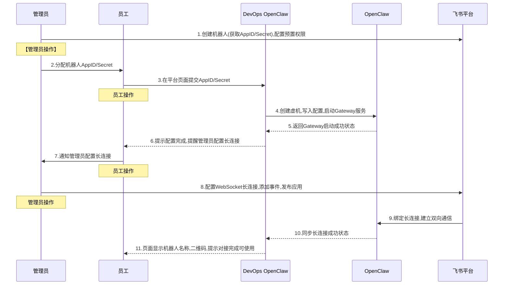

## 背景
- 公司使用飞书办公，飞书机器人由管理员统一创建和分配，员工无法自主创建机器人。
- 作为 devops 平台，准备给大家创建一个 openclaw 一键安装方案，在平台点击安装 openclaw 后，自动化创建虚拟机，并根据 appid 和 secrete 配置飞书机器人插件
- 创建后需要管理员配合配置长连接
- 规划一下这个平台，前端支持员工快速创建 openclaw，后台管理端支持对所有openclaw 虚拟机和服务进行监控和管理

参考：https://openclaw.feishu.cn/
截图参考：docs/images

# DevOps OpenClaw 部署流程

