# DevOps OpenClaw 用户手册

> 版本：v1.0 | 更新日期：2026-04-14

---

## 目录

- [1. 产品简介](#1-产品简介)
- [2. 快速开始](#2-快速开始)
- [3. 员工端使用指南](#3-员工端使用指南)
  - [3.1 登录系统](#31-登录系统)
  - [3.2 落地页](#32-落地页)
  - [3.3 创建你的 AI 助手](#33-创建你的-ai-助手)
  - [3.4 管理已创建的项目](#34-管理已创建的项目)
  - [3.5 项目配置管理](#35-项目配置管理)
- [4. 管理员端使用指南](#4-管理员端使用指南)
  - [4.1 管理仪表盘](#41-管理仪表盘)
  - [4.2 实例管理](#42-实例管理)
  - [4.3 全局配置](#43-全局配置)
  - [4.4 审批管理](#44-审批管理)
- [5. 常见问题 (FAQ)](#5-常见问题-faq)

---

## 1. 产品简介

DevOps OpenClaw 是企业内部的 OpenClaw 托管平台，模仿飞书 OpenClaw 的产品体验，让公司员工**一键创建专属 AI 助手**，并通过飞书直接对话交互。

### 产品定位

### 核心价值

| 特性 | 说明 |
|------|------|
| **一键部署** | 无需了解底层基础设施，点击即可创建专属 AI 助手 |
| **飞书原生体验** | 通过飞书机器人实现双向实时对话，如同使用普通飞书联系人 |
| **企业级安全** | 虚拟机部署在企业内部，数据不出企业边界，统一凭证管理 |

### 用户角色

| 角色 | 说明 |
|------|------|
| **员工** | 使用平台一键创建和管理个人 AI 助手 |
| **管理员** | 管理飞书凭证、审批长连接、监控所有实例运行状态 |

---

## 2. 快速开始

**三步拥有你的 AI 助手：**

> 整个过程通常只需 2-3 分钟，无需任何技术背景。

---

## 3. 员工端使用指南

### 3.1 登录系统

打开 DevOps OpenClaw 平台地址，首次访问时会弹出登录窗口：

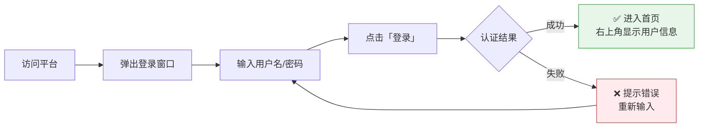

> **提示：** 登录状态会自动保持，关闭浏览器后再次访问无需重新登录。系统会自动刷新登录凭证，确保使用体验流畅。

---

### 3.2 落地页

首次登录后会看到平台落地页，展示平台的核心能力。

落地页包含以下区域：

- **Hero 区域** — 大标题和平台介绍，配有动画效果
- **特性卡片** — 展示三大核心能力：一键部署、原生体验、企业级安全
- **页脚** — 平台信息和相关链接

点击页面中的 **「创建 OpenClaw」** 按钮即可开始创建流程。

---

### 3.3 创建你的 AI 助手

#### 创建流程总览

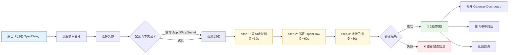

#### 第一步：引导创建

如果还没有创建过项目，首页会显示引导创建界面，引导你开始第一次创建。

点击 **「创建 OpenClaw」** 按钮打开创建弹窗。

#### 第二步：设置项目信息

在创建弹窗中：

1. **项目名称** — 为你的 AI 助手起一个名字（系统会实时校验名称是否可用）
2. **选择头像** — 从 12 个预设头像中选择一个喜欢的
3. **飞书渠道配置**（可选）：
   - 如果管理员已为你分配了飞书机器人凭证，填入 AppID 和 AppSecret
   - 如果没有，可以点击「跳过」，后续再配置

点击 **「创建」** 按钮开始部署。

#### 第三步：等待部署完成

系统会自动执行以下部署步骤，实时显示进度：

| 步骤 | 说明 | 预计耗时 |
|------|------|----------|
| Step 1 | 启动云端电脑（虚拟机创建） | ~30 秒 |
| Step 2 | 启动 OpenClaw（服务部署） | ~60 秒 |
| Step 3 | 连接飞书（WebSocket 长连接） | ~30 秒 |

> **提示：** 部署过程中可以继续浏览其他页面，进度会在后台持续更新。

#### 第四步：创建完成

部署成功后会显示完成提示，你可以：

- **打开 Gateway Dashboard** — 进入 OpenClaw 管理面板
- **在飞书中对话** — 直接跳转飞书，开始与 AI 助手交流
- **返回首页** — 回到项目列表

---

### 3.4 管理已创建的项目

创建完成后，首页会显示你的项目卡片。

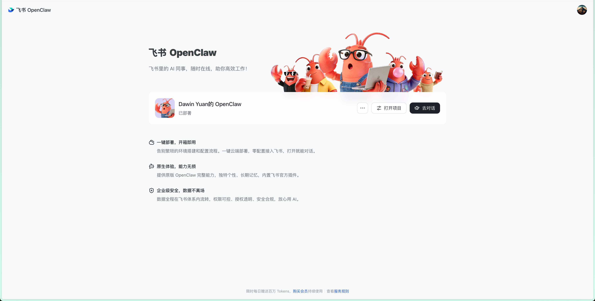

#### 项目卡片信息

每个项目卡片展示以下信息：

- **项目名称和头像**
- **状态标签** — 表示当前运行状态：

| 状态 | 颜色 | 说明 |
|------|------|------|
| 创建中 | 蓝色 | 正在部署，请稍候 |
| 已部署 | 绿色 | 运行正常，可以使用 |
| 审批中 | 橙色 | 等待管理员审批飞书长连接 |
| 异常 | 红色 | 出现错误，需要处理 |

#### 快速操作

- **查看机器人信息** — 查看和复制 AppID 等凭证信息

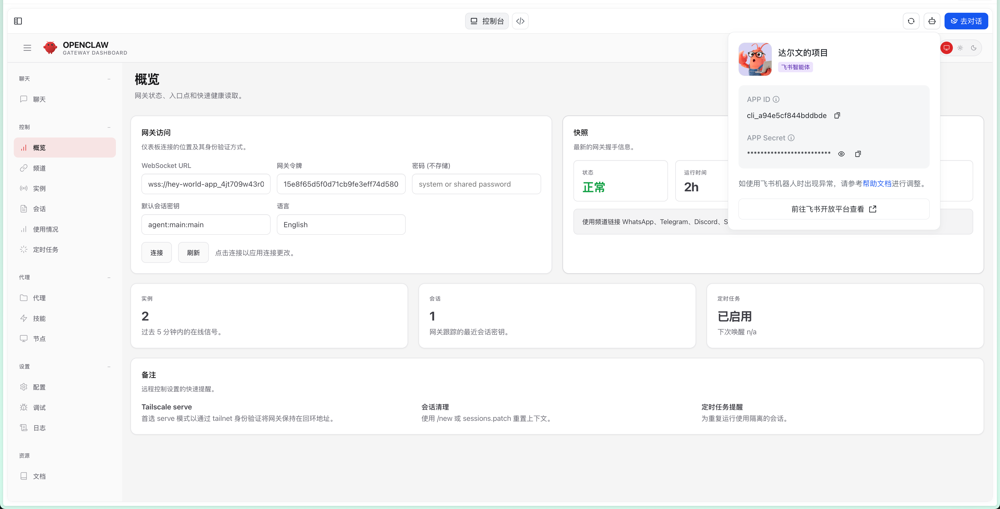

- **打开 Gateway Dashboard** — 进入 OpenClaw 管理面板进行高级配置
- **在飞书中对话** — 跳转到飞书与 AI 助手交流

#### 删除项目

如需删除项目，点击项目卡片上的删除按钮。系统会要求**二次确认**以防止误操作。

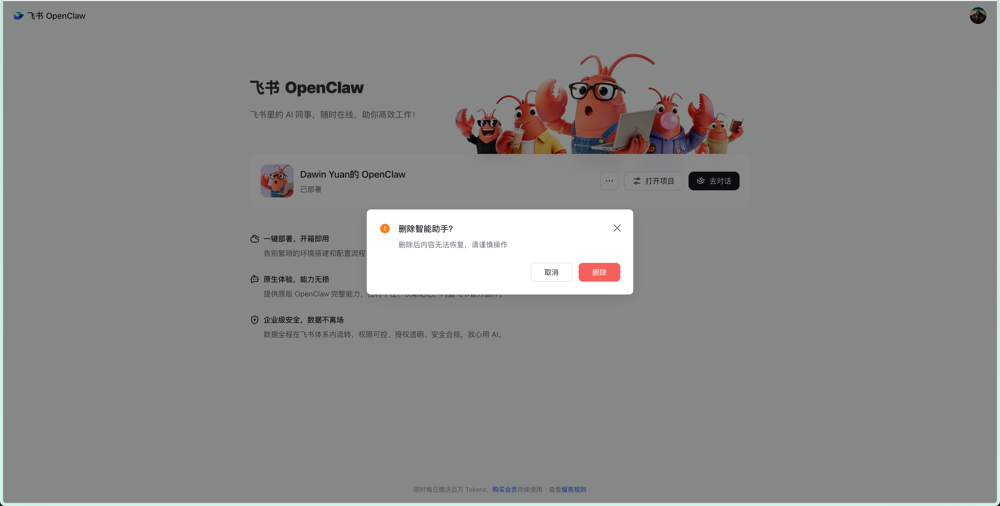

> ⚠️ **注意：** 删除操作不可逆，会同时销毁关联的虚拟机和所有数据。请确认已备份重要内容。

---

### 3.5 项目配置管理

点击项目卡片进入配置管理页面，提供三种操作模式：

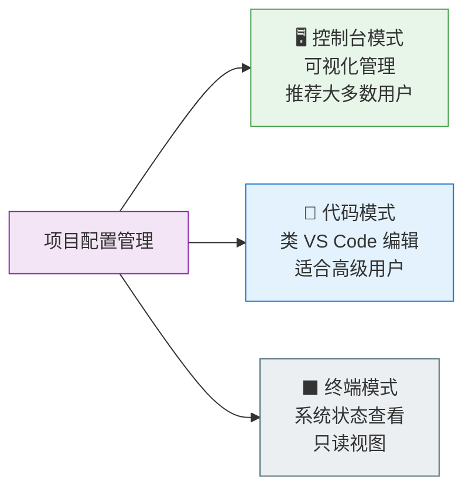

#### 控制台模式

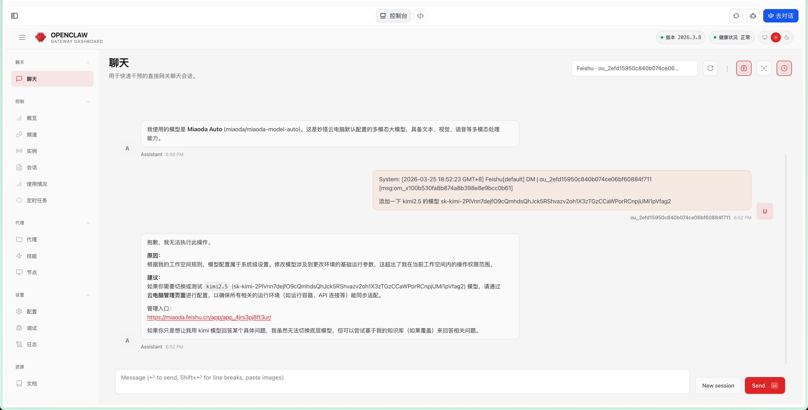

控制台模式通过内嵌 Gateway Dashboard 提供可视化管理能力，包含 11 项菜单功能：

- 对话管理、知识库管理、技能配置
- 模型设置、插件管理、系统设置
- 健康检查、运行日志等

> 这是最常用的管理方式，推荐大多数用户使用控制台模式。

#### 代码模式

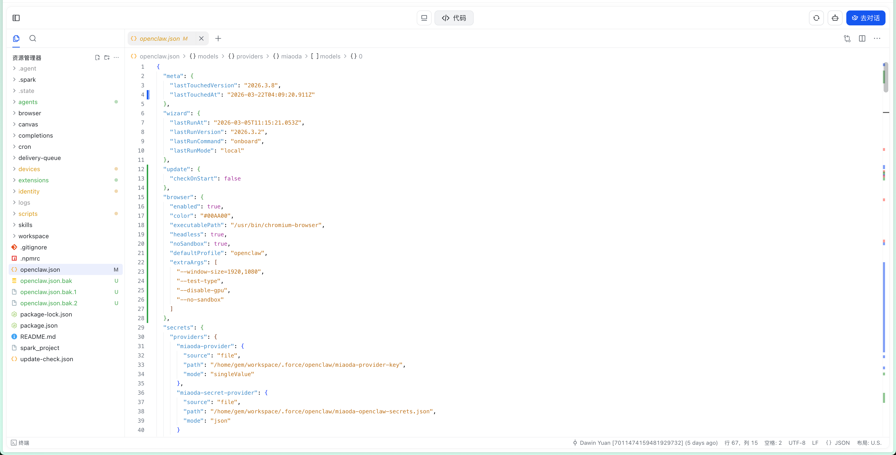

代码模式提供类 VS Code 的编辑体验，适合需要精细配置的高级用户：

- **文件浏览器** — 左侧树状目录，展示配置文件结构
- **代码编辑器** — Monaco Editor，支持语法高亮和智能提示
- **多标签页** — 同时打开多个文件，方便对比和编辑
- **自动保存** — 编辑后自动保存，无需手动操作
- **可调整布局** — 拖拽分隔栏调整文件树和编辑区比例

#### 终端模式

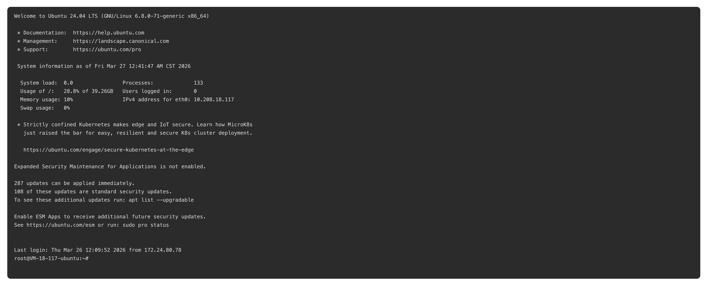

终端模式以终端风格展示系统信息：

- **系统状态** — CPU、内存、存储使用情况
- **YAML 配置预览** — 查看当前运行的完整配置
- **光标动画** — 模拟真实终端的打字效果

> 终端模式为只读视图，适合快速查看系统状态和配置概览。

---

## 4. 管理员端使用指南

管理员可通过导航栏切换到管理端，访问管理仪表盘和系统配置。

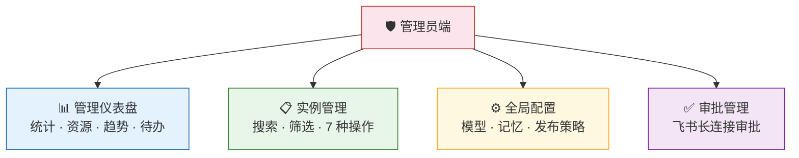

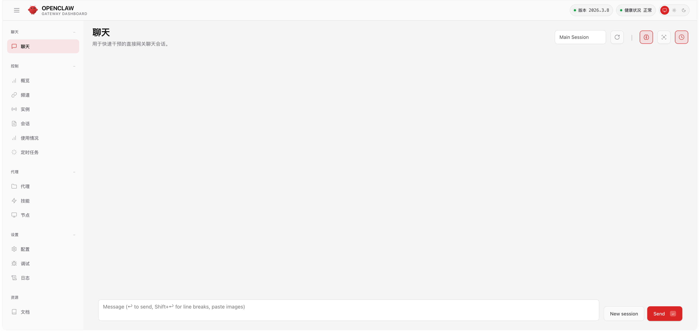

### 4.1 管理仪表盘

管理仪表盘提供全局运营视图：

#### 统计卡片

页面顶部展示四项关键指标：

| 指标 | 说明 |
|------|------|
| 实例总数 | 平台上所有 OpenClaw 实例的数量 |
| 运行中 | 当前正常运行的实例数量 |
| 已停止 | 已手动停止的实例数量 |
| 异常 | 出现错误需要处理的实例数量 |

#### 资源使用情况

以进度条形式展示整体资源消耗：

- **CPU 使用率** — 所有实例的 CPU 总使用占比
- **内存使用率** — 内存占用情况
- **存储使用率** — 磁盘空间使用情况
- **网络使用率** — 带宽使用情况

#### 趋势图

交互式折线图展示实例数量的变化趋势，支持切换时间范围（7 天 / 30 天 / 90 天）。

#### 待办事项

显示需要管理员处理的待办项目，如待审批的长连接请求、异常实例告警等。

---

### 4.2 实例管理

实例管理页面提供所有 OpenClaw 实例的集中管控能力。

#### 实例列表

- **搜索** — 按实例名称、用户名搜索（支持 300ms 防抖）
- **筛选** — 按状态筛选（全部/运行中/已停止/异常/创建中）
- **排序** — 按创建时间、名称、状态排序
- **分页** — 支持大量实例的分页浏览

#### 实例操作

选中实例后可执行以下操作：

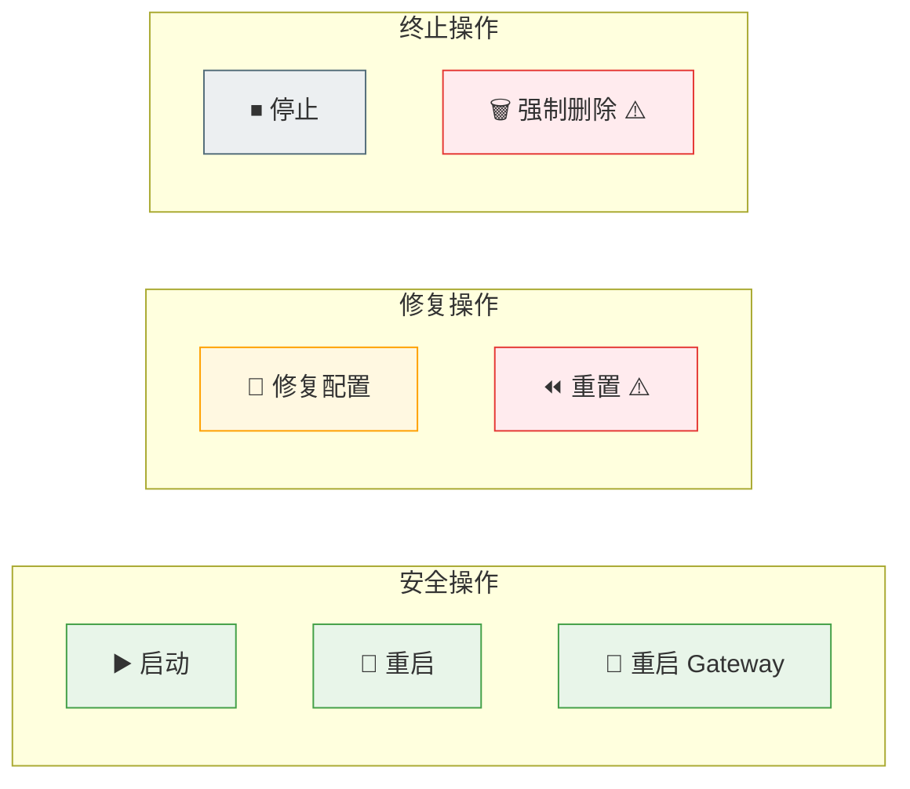

| 操作 | 说明 | 使用场景 |
|------|------|----------|
| **启动** | 启动已停止的实例 | 恢复使用 |
| **重启** | 重启实例 | 实例异常时尝试恢复 |
| **重启 Gateway** | 仅重启 Gateway 服务 | Gateway 连接异常 |
| **修复配置** | 重新应用标准配置 | 配置文件损坏或错误 |
| **重置** | 重置实例到初始状态 | 严重异常需要初始化 |
| **停止** | 停止实例运行 | 员工离职或暂停使用 |
| **强制删除** | 彻底删除实例和数据 | 清理无用实例 |

> ⚠️ **重置**和**强制删除**操作不可逆，请谨慎使用。

#### 创建实例（管理员）

管理员也可以为指定员工创建实例，流程分三步：

1. 选择目标员工
2. 设置项目名称和头像
3. 配置飞书凭证

#### 实例详情

点击实例行可打开详情侧边栏，查看：

- 实例基本信息（名称、用户、创建时间）
- 运行状态和资源占用
- 操作日志记录

---

### 4.3 全局配置

全局配置页面用于管理平台级别的设置，影响所有实例。

#### 模型配置

| 配置项 | 说明 |
|--------|------|
| **模型提供商** | 支持 Anthropic / OpenAI / DeepSeek / 自定义 |
| **API Key** | 模型服务的认证密钥（掩码显示，安全存储） |
| **Base URL** | 自定义模型服务地址（自建模型时使用） |
| **默认模型** | 新建实例使用的默认模型名称 |
| **最大 Token** | 单次对话的 Token 上限 |
| **Temperature** | 模型回复的创造性参数（0-1） |

#### 记忆配置

| 配置项 | 说明 |
|--------|------|
| **启用记忆** | 是否开启 AI 助手的持久记忆功能 |
| **记忆策略** | 记忆的存储和检索策略 |
| **上下文限制** | 每次对话携带的记忆上下文数量 |
| **保留天数** | 记忆数据的保留时长 |

#### 发布策略

控制新实例的发布和审批流程。

---

### 4.4 审批管理

审批管理页面用于处理员工的飞书长连接申请。

#### 查看方式

支持两种视图模式（偏好设置会自动保存）：

- **卡片视图** — 以卡片形式展示每条审批请求，信息更直观
- **列表视图** — 以表格形式展示，适合批量处理

#### 审批流程

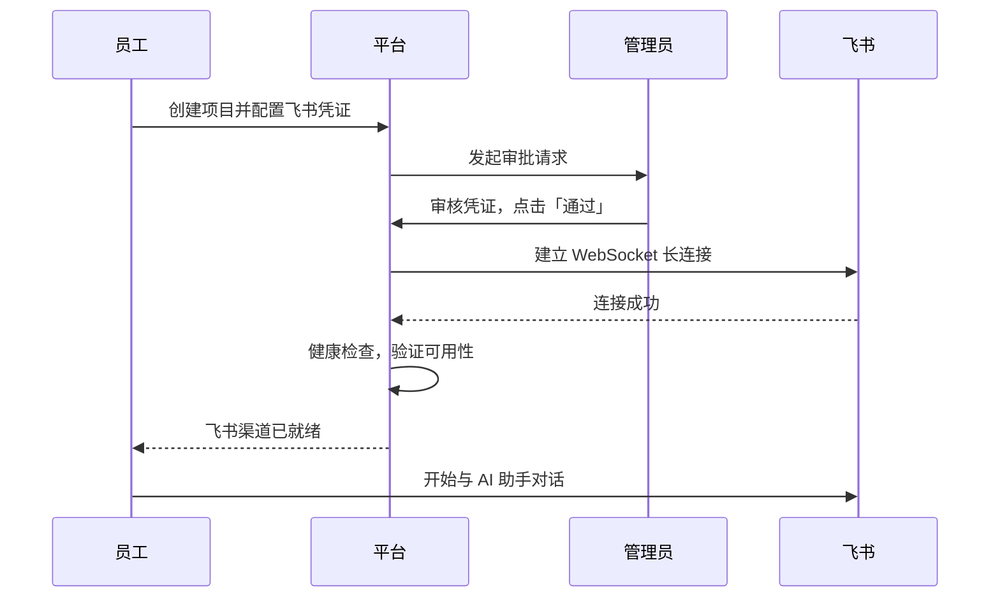

#### 状态筛选

| 状态 | 说明 |
|------|------|
| 全部 | 显示所有审批记录 |
| 待审批 | 尚未处理的请求 |
| 已通过 | 已批准并完成连接的请求 |

#### 配置指南

审批页面还提供**可折叠的配置指南**，帮助管理员了解飞书机器人的配置步骤。

---

## 5. 常见问题 (FAQ)

### 员工常见问题

**Q: 创建项目后多久可以使用？**
A: 通常 2-3 分钟内即可完成部署。如果超过 5 分钟仍未完成，请联系管理员检查系统状态。

**Q: 可以创建多少个 AI 助手？**
A: 当前版本每个员工限创建一个 AI 助手实例。如需更多，请联系管理员。

**Q: 忘记密码怎么办？**
A: 请联系系统管理员重置密码。

**Q: 飞书渠道配置可以跳过吗？**
A: 可以。跳过后你仍可通过 Gateway Dashboard 使用 AI 助手的 Web 界面，但无法在飞书中直接对话。后续可以在项目配置中补充飞书凭证。

**Q: 删除项目后数据还能恢复吗？**
A: 不能。删除操作会彻底销毁虚拟机及其上的所有数据，请在删除前确认已备份重要内容。

**Q: AI 助手的回复质量不佳怎么办？**
A: 可以进入控制台模式，调整模型设置中的 Temperature 参数，或联系管理员切换模型提供商。

**Q: 项目名称有什么限制？**
A: 项目名称最多 30 个字符，不能为空或全空格。支持中文、英文、数字等任意字符组合。

**Q: 部署过程中某个步骤失败了怎么办？**
A: 进度弹窗会标红失败的步骤。你可以关闭弹窗后重新发起创建，系统会从头执行完整的部署流程。如果反复失败，请联系管理员检查后端资源状态。

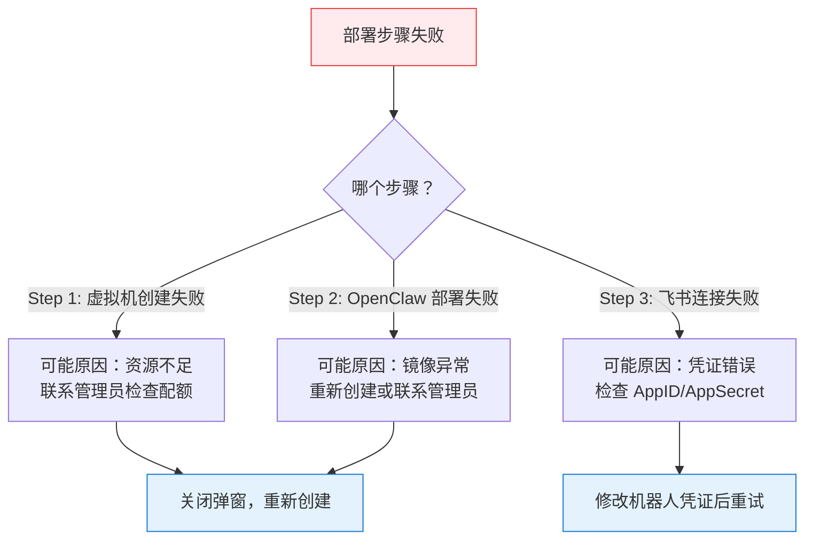

**Q: 页面一直显示加载中，进不去怎么办？**
A: 可能是网络问题或登录凭证已过期。尝试以下步骤：
1. 刷新浏览器页面
2. 如果仍然卡住，清除浏览器缓存后重新登录
3. 检查网络连接是否正常

**Q: 登录时提示「用户名或密码错误」，但我确认密码正确？**
A: 请注意以下几点：
- 用户名区分大小写，确认拼写无误
- 如果多次尝试仍失败，可能是账号被锁定，请联系管理员
- 网络异常时也可能显示此错误，请检查网络连接

**Q: 如何配置飞书机器人凭证？在哪里获取 AppID 和 AppSecret？**
A: 飞书机器人凭证由管理员统一分配。请联系管理员获取，拿到后在项目卡片中点击机器人信息区域，进入编辑模式填写：
- **App ID** — 必须以 `cli_` 开头（如 `cli_a1b2c3d4`）
- **App Secret** — 长度不少于 8 位

**Q: 填了飞书凭证但状态显示「审批中」，什么时候能用？**
A: 凭证保存后需要管理员审批并配置飞书长连接，审批通过后状态会自动变为「已部署」。你可以先通过 Gateway Dashboard 的 Web 界面使用 AI 助手，飞书对话功能在审批通过后自动开启。

**Q: 打开控制台模式显示「服务不可用」怎么办？**
A: 这表示 OpenClaw Gateway 服务未就绪。可能原因：
- 实例刚创建完成，Gateway 还在启动中 — 等待 1-2 分钟后刷新
- 实例状态异常 — 联系管理员执行「重启 Gateway」操作

**Q: 在代码模式中修改了配置文件，如何生效？**
A: 代码模式下的配置文件会自动保存。部分配置修改后需要重启 OpenClaw 服务才能生效，你可以联系管理员在实例管理中执行「重启」操作。

**Q: 项目状态一直显示「异常」怎么办？**
A: 「异常」状态表示实例运行出现错误。请联系管理员，管理员可以通过以下方式处理：

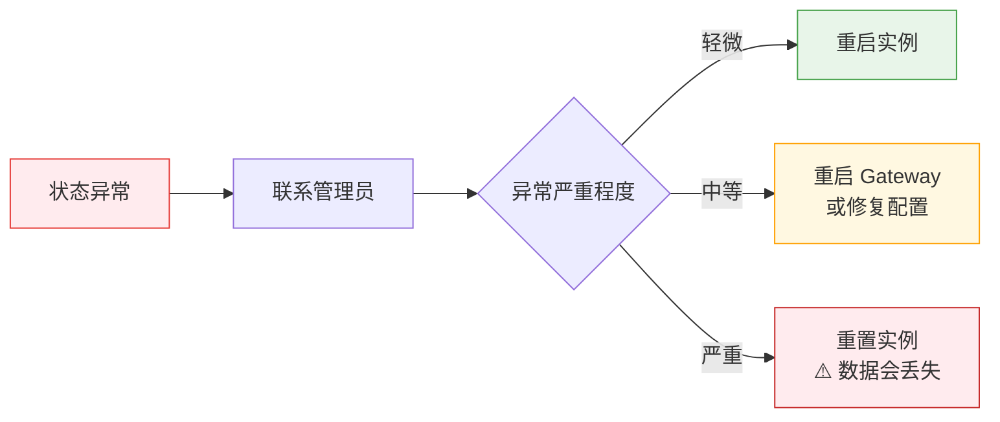

**Q: 可以同时在多个浏览器/设备上登录吗？**
A: 可以。系统支持多端同时登录，所有设备共享同一个项目和配置。

**Q: 我的 AI 助手对话内容会被其他人看到吗？**
A: 不会。每个员工的 AI 助手是独立的实例，运行在独立的虚拟机上，对话内容仅限你自己访问。管理员可以查看实例运行状态，但无法查看对话内容。

### 管理员常见问题

**Q: 如何批量管理实例？**
A: 在实例管理页面使用搜索和筛选功能定位目标实例，可以逐个执行操作。当前版本暂不支持批量操作。

**Q: API Key 如何安全存储？**
A: 系统对 API Key 进行加密存储，页面显示时自动掩码。仅在配置保存时传输完整密钥。

**Q: 实例异常如何排查？**
A: 在实例详情侧边栏中查看操作日志，通常可以找到异常原因。常见处理方式：
1. 尝试「重启」操作
2. 如果是 Gateway 问题，使用「重启 Gateway」
3. 配置异常使用「修复配置」
4. 严重问题使用「重置」（会丢失数据）

**Q: 如何更换模型提供商？**
A: 在全局配置页面选择新的模型提供商，填入对应的 API Key 和 Base URL，保存后所有新对话将使用新模型。已有对话不受影响。

---

> 📖 如需更多帮助，请联系 DevOps 团队或查阅 [产品需求文档](devops-claw-prd.md)。
